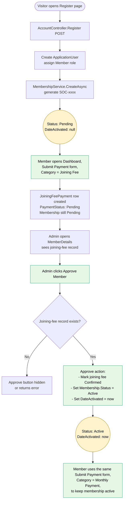

# Membership Approval Flow

End-to-end trace of how a registration becomes an active membership.
This document describes the **intended** flow and lists the places where the current
code diverges from it.

For business-rule context see `SYSTEM_FLOW.md` (note: that doc is out of date — it still
describes the older "admin approves first, then member pays" flow).

---

## Intended flow

1. Visitor registers an account.
2. Membership is created with `Status = Pending`.
3. Member pays the **joining fee** and submits proof. The submission form is the same
   form used for monthly payments — the **category** (Joining Fee / Monthly Payment)
   distinguishes them.
4. The joining-fee record exists against the still-`Pending` membership.
5. Admin sees the joining-fee record on the member's detail page and clicks
   **Approve Member**. (Approve is only meaningful once a joining-fee record exists.)
6. Approval transitions the membership to `Active`, sets `DateActivated = now`, and
   marks the joining-fee payment as `Confirmed`.

Two membership states matter in this flow: `Pending` and `Active`. The intermediate
`PendingPayment` state is no longer needed.

---

## Flow diagram



---

## Gaps between intended flow and current code

| # | Where | Current behaviour | Intended behaviour |
|---|---|---|---|
| 1 | `Members/Dashboard.cshtml:362` | `canSubmitJoiningFee = Status == PendingPayment` — a `Pending` member cannot submit a joining fee from the Dashboard. | Pending members should be able to submit the joining fee. Predicate should be `Status == Pending` (no joining-fee record yet, or pending one rejected). |
| 2 | `AdminController.ApproveMember` (lines 87–102) | Approves only if `Status == Pending`. Calls `MembershipService.ActivateAsync`, which sets `Status = PendingPayment`. Does not touch the joining-fee payment. | Approve should: (a) require that a joining-fee record exists for the member, (b) mark that payment `Confirmed`, (c) set `Status = Active` and `DateActivated = now`. |
| 3 | `PaymentService.ConfirmJoiningFeeAsync` (lines 39–58) | Separate clerk action that confirms the joining fee and activates the membership. | No longer needed as a separate step. The "Approve Member" action does this in one shot. Can be removed or kept as a no-op admin tool. |
| 4 | `MembershipStatus.PendingPayment` enum value | Used as the in-between state and as a gate everywhere. | Becomes dead. Either remove the value or stop using it. |
| 5 | `Payments/PendingJoiningFees.cshtml` page + `Payments/PendingMonthly.cshtml` | Separate clerk queue for confirming joining fees. | Joining-fee confirmations now happen via Approve Member on the member's detail page. The page is no longer needed for joining fees (monthly stays). |
| 6 | Status alerts on `Members/Dashboard.cshtml` (lines 76–93) | Two alerts — one for `Pending` ("awaiting approval"), one for `PendingPayment` ("approved, pay R150"). | Single alert for `Pending`: "Pay your joining fee of R150 using `<membership number>` as reference. Once received, admin will approve your membership." |
| 7 | `SubmitJoiningFeeForMember` (office form, `AdminController.cs:509`) and `SubmitJoiningFee` (member standalone, `PaymentsController.cs:30`) | Standalone joining-fee forms. | The unified Submit Payment form on `Members/Dashboard.cshtml` already covers this. The standalone screens are dead in the new flow. |

---

## Suggested change set (smallest viable)

1. **Dashboard gate** — `Members/Dashboard.cshtml:362`:

   ```razor
   var canSubmitJoiningFee = Model.Status == MembershipStatus.Pending && !hasPendingFee;
   ```

2. **Approve Member** — rewrite `AdminController.ApproveMember`:

   - Require an existing `JoiningFeePayment` (any status, or specifically `Pending`).
   - On success: mark that payment `Confirmed`, set membership `Status = Active`,
     `DateActivated = DateTime.UtcNow`.
   - Hide / disable the Approve button on `Admin/MemberDetails` and `Admin/Members` when
     no joining-fee record exists yet.

3. **Status alert** — simplify the alerts on `Members/Dashboard.cshtml` so a `Pending`
   member sees a clear "pay joining fee, await approval" message that adapts to whether
   a pending joining-fee record already exists.

4. **Tests** — adjust `SocietyApp.Tests`:

   - `MembershipServiceTests` — `ActivateAsync` test will need to change or be deleted
     once that method's purpose changes / is removed.
   - `PaymentServiceTests` — `ConfirmJoiningFeeAsync` activation-on-confirm test will
     need to change or be deleted.
   - Add a new test: approving a `Pending` member with a joining-fee record activates
     them and marks the payment Confirmed.
   - Add a new test: approving a `Pending` member with no joining-fee record is refused.

5. **Documentation** — update `SYSTEM_FLOW.md` and `README.md` to match this flow, and
   remove the references to `PendingPayment` and the clerk Confirm Joining Fee step.

---

## Things to decide before coding

1. **Keep `PendingPayment` or remove it?** Removing is cleaner but is a breaking enum
   change. Keeping it dormant is safer.
2. **What about the existing clerk-side `PendingJoiningFees` queue?** Once approval
   confirms the payment, this queue becomes redundant for joining fees. Remove the page
   or repurpose it as a read-only audit list?
3. **Can a Pending member submit a second joining-fee record if the first was deleted by
   a clerk?** Current `HasPendingJoiningFeeAsync` check prevents duplicates — that should
   stay.
4. **Does the new Approve Member action also need to handle the case where the proof was
   never uploaded?** Probably yes — admin should be able to approve based on bank
   statement even if the member didn't upload an image.
