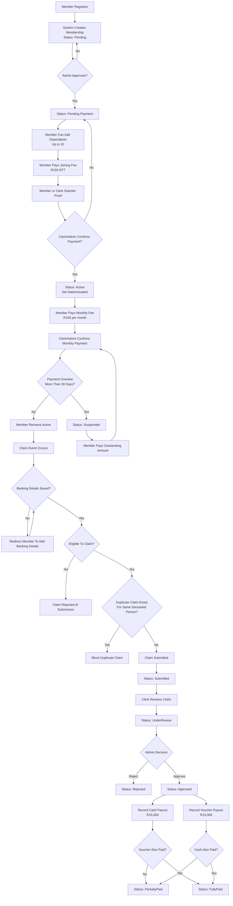

# System Flow

This document captures the core end-to-end flows that must keep working.

## Visual Flow

## 1) Member Registration and Activation

1. Member registers through `Account/Register`.
2. System creates `ApplicationUser` and assigns role `Member`.
3. System creates `Membership` with status `Pending` and generated membership number (`SOC-xxxx`).
4. Admin approves the member, which transitions the membership to `PendingPayment`.
5. Member can add up to 10 dependants while pending/pending-payment/active/suspended.
6. Member submits joining fee proof from member portal, or office staff submits on behalf of the member.
7. Clerk/Admin confirms joining fee in pending-joining-fees queue.
8. On confirmation, system transitions membership to `Active` and sets `DateActivated`.

## 2) Dependant Management

1. Member opens `Members/Dependants`.
2. Member adds dependant from `Members/AddDependant`.
3. Controller binds add/remove operations to the logged-in member's own membership.
4. Service enforces hard limit: maximum 10 dependants per membership.
5. Admin/Clerk can add or remove dependants from member details (`Admin/MemberDetails`).

## 3) Monthly Payments and Suspension

1. Member or office staff submits monthly payment proof for a target month.
2. System records payment as `Pending` and normalizes `ForMonth` to first day of month.
3. Clerk/Admin confirms payment, status moves to `Confirmed`.
4. Overdue check computes expected months from `DateActivated` onward.
5. If any expected month remains unpaid past grace period (30 days), membership is overdue.
6. Dashboard flow invokes suspension check; overdue `Active` memberships become `Suspended`.

## 4) Claims Lifecycle

1. Member/staff submits death claim.
2. Eligibility check validates:
   - Membership is `Active`.
   - Waiting period (6 months from activation) is met.
   - No overdue monthly payment.
   - Banking details are already saved for payout.
   - No earlier claim exists for the same deceased person.
3. Submitted claim is stored with default payout values:
   - Cash: R15,000
   - Voucher: R15,000
4. Claim moves through status pipeline:
   - `Submitted` -> `UnderReview` -> (`Approved` or `Rejected`)
5. Payout recording changes status:
   - One side paid: `PartiallyPaid`
   - Both cash and voucher paid: `FullyPaid`

## 5) Admin and Clerk Governance

1. Admin and Clerk share operations for payment processing and member support.
2. Admin-only actions include member approval, reactivation/deactivation, and permanent deletion.
3. Admin can create clerk accounts.

## Core Invariants (Must Never Break)

1. Membership numbers are sequential in `SOC-xxxx` format.
2. Joining fee confirmation can activate pending membership.
3. Dependants per membership never exceed 10.
4. Claims default to the configured payout amounts.
5. Claim payout status transitions are consistent (`PartiallyPaid`/`FullyPaid`).
6. Overdue logic can suspend active memberships when grace period is exceeded.
